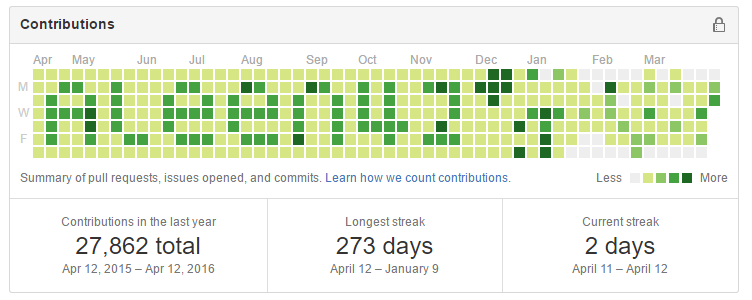
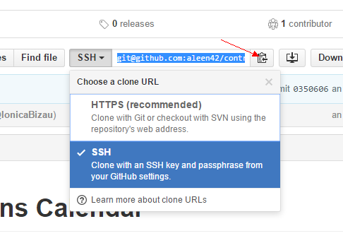

## auto-contribution

[](#) [](https://github.com/aleen42/auto-contribution/issues) [](https://raw.githubusercontent.com/aleen42/auto-contribution/master/LICENSE) [](https://badge.fury.io/js/auto-contribution) [](https://travis-ci.org/aleen42/auto-contribution) 
[](https://github.com/aleen42/auto-contribution) [](https://gitter.im/aleen42/auto-contribution?utm_source=badge&utm_medium=badge&utm_campaign=pr-badge) 



a node.js module for automatically generating contributions on github without worrying about its movement in the next week. **This module is only used in Linux.**

#### Installation

###### NPM Installation

```bash
npm install auto-contribution
cd ./node_modules/auto-contribution
npm i
```

###### Clone Installation

```bash
git clone https://github.com/aleen42/auto-contribution.git
cd auto-contribution
npm i
```

#### Usage

**i.** Setup your repository to store generated commits history

**ii.** Make sure you have set up SSH for this repo, because I should update your remote repo

**iii.** Enter root mode to run test:

```bash
npm test
```

**iv.** Enter root mode to run if all test cases have passed:

```bash
npm start <repo-url under SSH> <coordinates data json file path>

# example: npm start git@github.com:aleen42/contribution.git example.json
```

*repo-url under SSH: the repo url should be under SSH protocol like `git@github.com:aleen42/contribution.git`*



*coordinates data json file path: you should put your data generated by [**IonicaBizau/github-contributions**](https://github.com/IonicaBizau/github-contributions) into a json file and give the path of it*

**iv.** Without any problems of updating remote repository, you can use `crontab` to set this script in the root mode to automatically update every week like this:

```bash
# su
# crontab -e

# Edit this file to introduce tasks to be run by cron.
#
# Each task to run has to be defined through a single line
# indicating with different fields when the task will be run
# and what command to run for the task
#
# To define the time you can provide concrete values for
# minute (m), hour (h), day of month (dom), month (mon),
# and day of week (dow) or use '*' in these fields (for 'any').#
# Notice that tasks will be started based on the cron's system
# daemon's notion of time and timezones.
#
# Output of the crontab jobs (including errors) is sent through
# email to the user the crontab file belongs to (unless redirected).
#
# For example, you can run a backup of all your user accounts
# at 5 a.m every week with:
# 0 5 * * 1 tar -zcf /var/backups/home.tgz /home/
#
# For more information see the manual pages of crontab(5) and cron(8)
#
# m h  dom mon dow   command
0 0 * * 0 npm start git@github.com:aleen42/contribution.git example.json
```

#### Tests

```bash
npm test
```

*Notice that: the repository generated with test case will be in `./auto-contribution/node_modules/gh-contributions/lib/public/repos/`*

#### Release History

* 1.0.0 Initial release
	* 1.1.0 Catch some exceptions
	* 1.1.1 Update readme.md

#### :yum: How to contribute

Have an idea? Found a bug? See [how to contribute](https://aleen42.gitbooks.io/personalwiki/content/contribution.html).

#### :scroll: License

[MIT](https://aleen42.gitbooks.io/personalwiki/content/MIT.html) © aleen42
